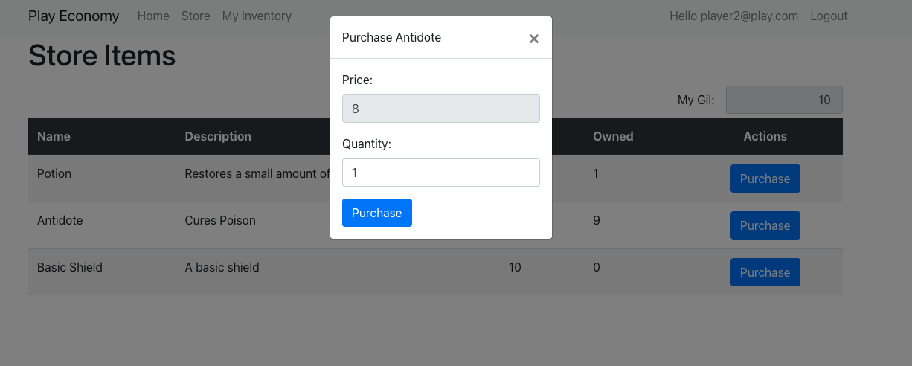

# Play-Economy
A project showcasing a player transaction platform. This project is currently being developed and the current images showcase is what's currently developed thus far. This project is on the works to be released in production in the Cloud. 

# Design

    

## Mongo Setup

    

## Identity Setup

    

    

## Purchase Saga Setup

    

    

# Frontend Experience

    

    

    

    

